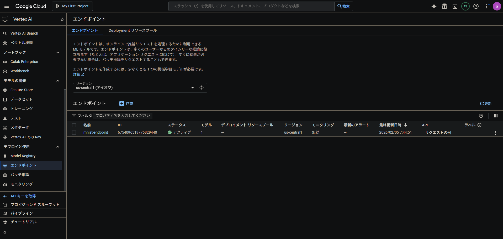
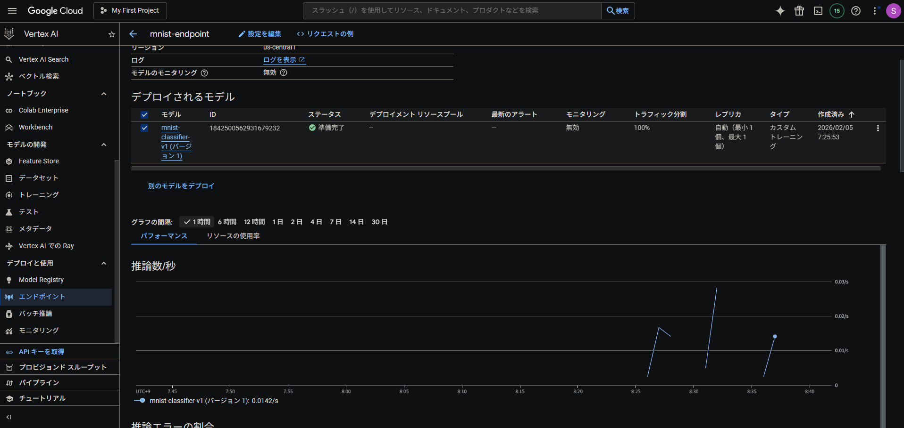
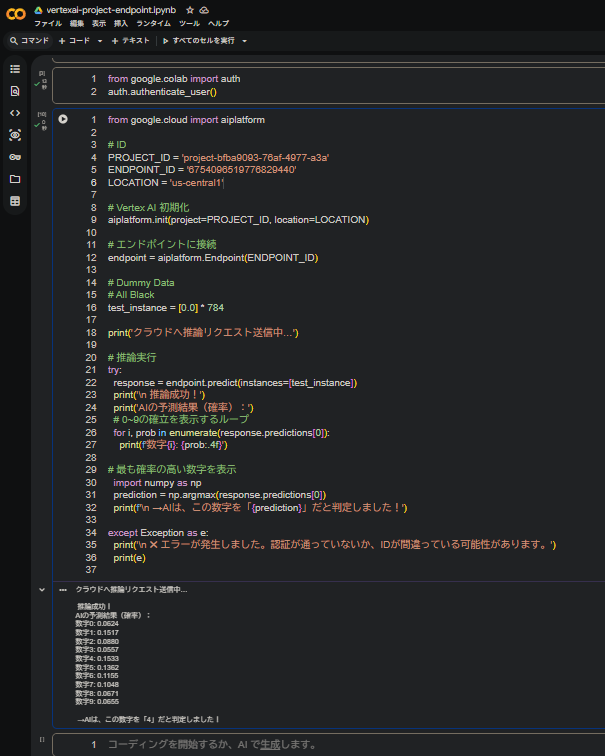

# Vertex AI ML Deployment: End-to-End MNIST Classification


This repository demonstrates a complete Machine Learning workflow—from mathematical foundations and model architecture design to training and cloud-ready deployment. The project focuses on classifying handwritten digits using the MNIST dataset and is optimized for deployment on **Google Cloud Vertex AI**.

## 🚀 Project Highlights
* **Full Pipeline:** Implements the entire ML lifecycle: Data preprocessing → Model Design → Training → Evaluation → Model Export.
* **Production Ready:** The model is exported in the native `.keras` format, ready to be registered in the **Vertex AI Model Registry**.
* **Scalable Architecture:** Designed to be served as a REST API endpoint for real-world application integration.

---

## 🏗 Repository Structure
````text
vertex-ai-ml-deployment/
├── notebooks/
│   ├── 01_theory_and_math.ipynb        # Mathematical implementation from scratch
│   ├── 02_model_architecture.ipynb     # Deep Learning network design & layers
│   └── 03_training_and_evaluation.ipynb # Training loop and performance metrics
├── models/
│   └── mnist_model.keras               # Trained and serialized model file
└── README.md                           # Project documentation
````

---

## 📈 Model Performance
The model achieves high accuracy by utilizing a deep neural network with optimized hyper-parameters.

* **Test Accuracy**: 97% - 98%

* **Loss Function**: Sparse Categorical Crossentropy

* **Optimizer**: Adam

* **Evaluation**: High generalization capability verified with unseen test data.

---

## 🛠 Tech Stack
* **Language**: Python 3

* **Framework**: TensorFlow / Keras

* **Cloud Platform**: Google Cloud Platform (GCP)

* **Services**: Vertex AI (Model Registry & Endpoints), Cloud Storage (GCS)

* **Dataset**: MNIST (Handwritten Digits)

---

# 🌐 Cloud Deployment & MLOps Implementation
The model was successfully deployed as a production-grade API on **Google Cloud Vertex AI**.

### Infrastructure Specifications
- **Model Name**: `mnist-classifier-v1`
- **Location**: `us-central1`
- **Machine Type**: `n1-standard-2` (Compute Engine)
- **Serving Container**: Pre-built TensorFlow serving container

### Deployment Workflow (Completed)
1. **Artifact Hosting**: Uploaded the trained model artifacts to **Google Cloud Storage (GCS)**.
2. **Model Registration**: Imported the model into the **Vertex AI Model Registry** using a pre-built TensorFlow serving container.
3. **Endpoint Provisioning**: Created a **Vertex AI Endpoint** and deployed the model with a dedicated compute node.
4. **Client-Side Integration**: Developed a Python client using the `google-cloud-aiplatform` SDK to handle authentication and real-time gRPC/REST inference requests.

### Real-time Inference Result
The endpoint was tested with a dummy black-frame instance (784-dimensional vector), confirming successful API communication and tensor processing.

**API Response Example:**
- **Primary Prediction**: Class `4`
- **Confidence Score**: 0.1533
- **Status**: Deployment Verified & Active

The endpoint was tested with a dummy black-frame instance...

#### Vertex AI Endpoint Status


#### Inference Log


#### Colab Log


---

> [!NOTE]
> All cloud resources (Endpoints and Models) were successfully decommissioned after testing to ensure cost-efficiency and resource cleanup.

---


📝 Author
[koki-shiroyama0430]

GitHub: [https://github.com/koki-shiroyama0430]

LinkedIn: [www.linkedin.com/in/koki-shiroyama-067a87245]
